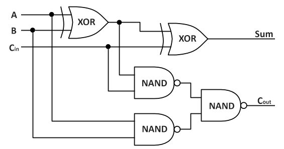
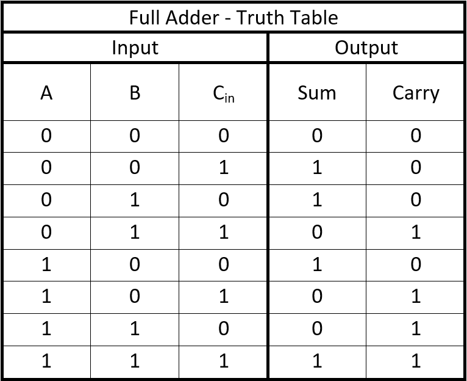
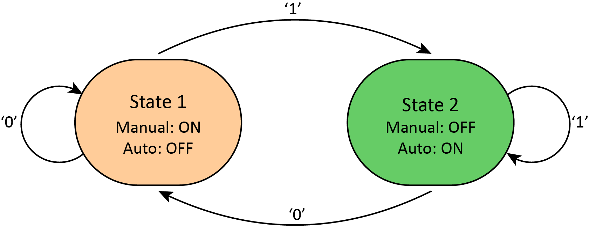
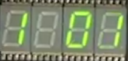
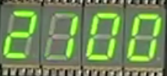

# MHP_2018_CI03_7
Watch our video here: https://www.youtube.com/watch?v=tTV4EAYKJ-w&feature=youtu.be 

## Full Adder
Our full adder is created with 2 XOR Logic gates and 3 NAND Logic gates.  
  
A full adder follows a truth table as such.  
 

## Bonus
Aim: FPGA tester works automatically by testing all the possible inputs using Finite State Machine(FSM).
HDL was written with proper comments, neat, and modular. Interface to 1-bit full adder allows manual testing and automatic testing using 
FPGA

### About FPGA
FPGA is a field-programmable gate array (FPGA) is an integrated circuit designed to be configured after manufacturing – hence "field-programmable". The FPGA configuration is generally specified using a hardware description language (HDL).  
 
FPGAs contain an array of programmable logic blocks, and a hierarchy of reconfigurable interconnects that allow the blocks to be "wired together", like many logic gates that can be inter-wired in different configurations. Logic blocks can be configured to perform complex combinational functions, or merely simple logic gates like AND and XOR. In most FPGAs, logic blocks also include memory elements, which may be simple flip-flops or more complete blocks of memory.  
https://en.wikipedia.org/wiki/Field-programmable_gate_array 

For our project, we used Lucid language to programme our Mojo.

### Mojo
Our Mojo comprises of 2 modes, Manual and Auto. These are the 2 main states for our FPGA.

###### Toggling between modes
Dip switch 23 is configured to switch between the mode. \
Manual mode is represented by 1 on the first seven segment from the left, while Auto mode is represented by 2.

#### Manual Mode
In Manual mode, 3 switches are programmed to output data into the full adder as A,B, Cin respectively. The inputs can be seen by the led that are above the switches.   
Dip switch 0 controls A  
Dip switch 1 controls B  
Dip switch 2 controls Cin  

Through the full-adder, the FPGA receives input about the state of SUM & Carry.  
FPGA would process the input from the full adder and display it as a 2 bit data.  

#### Auto Mode
In Auto mode, the output is sent out using a 3 bit data. Each bit is connected to an individual output port. The 3 bit output is displayed on the right 3 seven segment.  
  
By making use of a clock, the 3 bit output is increment by 1 in every clock cycle.  
.
#### Modules
6 modules were created in the process of the project
##### 1.mojo_top.luc
The main file for running the mojo.
##### 2.state_machin.luc 
The finite state machine which contains our code to switch between the 2 modes and what to display on the seven_segement  
##### 3.digit_lut.luc 
To configure the seven_segment to display it as a number.
##### 4.multi_seven_seg.luc  
With reference to the book "Learning FPGAs"- Alongside with decoder and digit_lut, numbers can be displayed on the led segment easily.
##### 5.decimal_counter.luc  
Increment loop for Auto mode  
##### 6.multi_dec_ctr.luc  
Trigger for the loop in Auto mode  

### About us
Project brought to you by \
1002744 Ivan Chuang \
1002769 Ryan Yu \
1002845 Tee Zhi Yao \
1003031 Tan Zhao Tong
